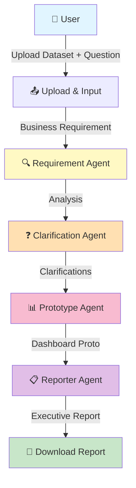
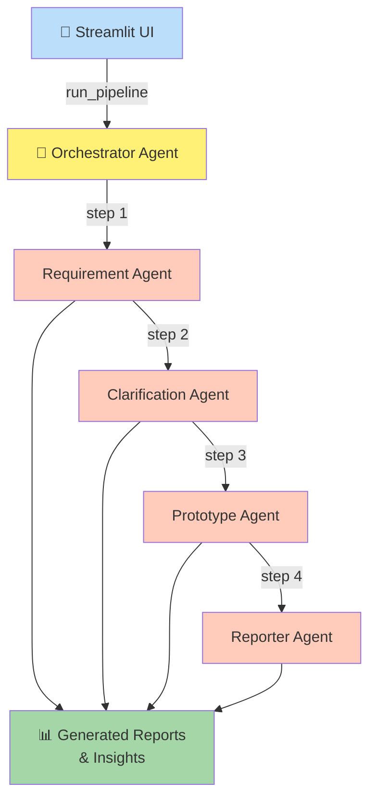

# 🚀 InsightForge – Multi-Agent Analytics Platform

*An AI-powered collaborative analytics platform that transforms business requirements into executive insights using specialized autonomous agents.*

---

## 📋 Overview

### The Business Problem

Modern analytics workflows are fragmented and time-consuming. Organizations struggle with:

- **Manual requirement analysis** consuming weeks of stakeholder meetings
- **Iterative clarification cycles** causing delays and communication gaps
- **Siloed analytics expertise** requiring multiple specialized roles
- **Extended timelines** from requirement to actionable insight

### The InsightForge Solution

InsightForge leverages a **multi-agent AI architecture** to automate the entire business analytics pipeline. Specialized autonomous agents work collaboratively to:

1. **Analyze** business requirements with precision
2. **Clarify** ambiguities through intelligent questioning
3. **Prototype** analytical solutions with ready-to-use dashboards
4. **Report** executive-ready insights with recommendations

Human oversight is maintained at critical approval points, ensuring quality and compliance.

---

## ✨ Key Features

| Feature | Description |
|---------|-------------|
| 🤖 **Multi-Agent Architecture** | Specialized AI agents for requirement analysis, clarification, prototyping, and reporting |
| 📊 **Business Requirement Analysis** | Automatic parsing and structuring of business problems into analytical frameworks |
| ❓ **Clarification Generation** | Intelligent follow-up questions to eliminate ambiguity before analysis |
| 📈 **Analytics Prototype Generation** | Automatic creation of proposed analytical solutions with KPIs and dimensions |
| 📋 **Executive Report Generation** | Professional, actionable reports with visualizations and recommendations |
| ✅ **Human-in-the-Loop Validation** | Approval gates ensure quality and align with organizational standards |
| 📝 **Comprehensive Audit Trail** | Complete tracking of decisions, changes, and agent reasoning |
| 🔧 **Modular Architecture** | Independent, reusable agents that can be extended or customized |
| 🎨 **Streamlit Interface** | Intuitive web-based UI for seamless user interaction |
| 🧩 **Extensible Agent Framework** | Design supports future agents (Validation, Review, Deployment) |

---

## 🔄 Solution Workflow



---

## 🏗️ System Architecture



---

## 🤖 Multi-Agent Architecture

| Agent | Responsibility | Input | Output |
|-------|---|---|---|
| **RequirementAgent** | Parses business requirements into structured analytical tasks | Business question, dataset context | Parsed requirements, KPIs, measures, dimensions |
| **ClarificationAgent** | Generates intelligent follow-up questions to eliminate ambiguity | Requirement analysis | Clarification responses, assumptions |
| **PrototypeAgent** | Designs prototype analytical solutions with visualizations | Requirements, clarifications | Dashboard prototype, chart specs, filters |
| **ReporterAgent** | Synthesizes findings into executive-ready reports | Prototype design, requirements, clarifications | HTML report with insights, recommendations |
| **OrchestratorAgent** | Coordinates workflow execution across all agents | Business requirement, context | Complete pipeline result with audit trail |

---

## 📁 Project Structure

```
InsightForge/
├── app/
│   └── streamlit_app.py              # Main Streamlit application
├── agents/
│   ├── requirement_agent.py           # Requirement analysis agent
│   ├── clarification_agent.py          # Clarification question generation
│   ├── prototype_agent.py              # Dashboard prototype creation
│   ├── reporter_agent.py               # Executive report generation
│   ├── orchestrator_agent.py           # Workflow orchestration
│   └── base_agent.py                   # Base agent class
├── utils/
│   ├── llm_helper.py                   # LLM initialization & helpers
│   ├── agent_trace.py                  # Execution tracing & audit logs
│   ├── agent_factory.py                # Agent factory pattern
│   └── validators.py                   # Input validation utilities
├── reports/
│   └── report_*.html                   # Generated reports
├── data/
│   └── sample_data.csv                 # Sample datasets
├── config/
│   └── settings.py                     # Configuration & constants
├── requirements.txt                    # Python dependencies
├── .env.example                        # Environment variables template
├── README.md                           # This file
└── LICENSE                             # MIT License
```

---

## 🛠️ Technology Stack

| Component | Technology | Purpose |
|-----------|-----------|---------|
| **Language** | Python 3.13+ | Core implementation |
| **UI Framework** | Streamlit | Web interface for user interaction |
| **Data Processing** | Pandas | Data manipulation & analysis |
| **Agent Framework** | LangChain | LLM orchestration & chains |
| **LLM Provider** | Google Gemini / OpenAI | AI-powered agents |
| **Visualization** | Plotly | Interactive charts & dashboards |
| **Database** | DuckDB | Lightweight SQL analytics |
| **Report Generation** | Jinja2, HTML/CSS | Professional report templating |
| **Logging** | Python logging | Execution traces & audit trails |

---

## 🚀 Installation

### Prerequisites
- Python 3.13 or higher
- pip package manager
- Virtual environment (recommended)

### Steps

#### 1. Clone the Repository
```bash
git clone https://github.com/yourusername/InsightForge.git
cd InsightForge
```

#### 2. Create Virtual Environment
```bash
python -m venv venv
```

#### 3. Activate Virtual Environment

**Windows:**
```bash
venv\Scripts\activate
```

**macOS/Linux:**
```bash
source venv/bin/activate
```

#### 4. Install Dependencies
```bash
pip install -r requirements.txt
```

#### 5. Configure API Keys

Create a `.env` file in the project root:
```bash
cp .env.example .env
```

Edit `.env` with your credentials:
```env
GOOGLE_API_KEY=your_google_gemini_api_key
OPENAI_API_KEY=your_openai_api_key (optional)
```

#### 6. Run the Application
```bash
streamlit run app/streamlit_app.py
```

The application will open in your browser at `http://localhost:8501`

---

## 📖 How to Use

### Complete Workflow

#### **Step 1: Launch Application**
```bash
streamlit run app/streamlit_app.py
```

#### **Step 2: Upload Dataset**
- Click "Upload CSV File" button
- Select a CSV file containing your business data
- Data preview displays automatically

#### **Step 3: Enter Business Problem**
- Describe your business question or analytical need
- Provide context (optional but recommended)
- Example: *"Analyze which product categories have declining sales trends and identify regions underperforming compared to Q3 2025"*

#### **Step 4: Requirement Agent Processes**
- Automatically parses your requirement
- Identifies KPIs, dimensions, measures, and filters
- Structures the analytical problem

#### **Step 5: Clarification Agent Validates**
- Generates intelligent follow-up questions
- Asks for business context and assumptions
- Refines requirements based on clarifications

#### **Step 6: Prototype Agent Creates Solution**
- Designs analytical dashboard structure
- Specifies recommended visualizations
- Defines calculated measures and filters

#### **Step 7: Reporter Agent Generates Report**
- Creates professional executive report
- Includes insights and recommendations
- Adds implementation notes and risks

#### **Step 8: Download & Review**
- Download the generated HTML report
- Share with stakeholders
- Review audit trail for transparency

---

## 💡 Sample Business Questions

InsightForge handles diverse analytical requests:

1. **Which products generate the highest revenue?**
   - Revenue by product category, trend analysis, growth rates

2. **Identify sales trends across quarters**
   - Time-series analysis, seasonal patterns, growth trajectories

3. **Find top-performing regions**
   - Regional revenue comparison, market share, growth leaders

4. **Which customers contribute the most revenue?**
   - Customer segmentation, RFM analysis, value distribution

5. **Analyze monthly revenue growth patterns**
   - Month-over-month comparisons, growth rates, variance analysis

6. **What product categories are declining?**
   - Declining products, margin compression, market shift analysis

7. **Compare sales performance by channel**
   - Channel mix, profitability by channel, channel trends

8. **Which products have the highest profit margins?**
   - Profitability analysis, margin by product, margin trends

9. **Identify seasonal demand patterns**
   - Seasonality analysis, peak periods, demand forecasting

10. **Generate executive summary of annual performance**
    - KPI scorecards, trend summaries, strategic insights

---

## 📥 Input Format

### Supported Datasets

- **File Type:** CSV (Comma-Separated Values)
- **Format:** Standard tabular data with headers
- **Multiple Files:** Can be uploaded and merged
- **Size:** Recommended under 100MB for optimal performance

### Business Question Requirements

- **Format:** Natural language or structured requirement
- **Length:** 1-500 characters
- **Content:** Clear description of analytical objective
- **Optional:** Business context, assumptions, constraints

### Example Input
```csv
Date,Product,Region,Channel,Revenue,Units,Cost
2025-01-01,Widget A,North,Online,5000,50,2500
2025-01-01,Widget B,South,Retail,3200,40,1600
2025-01-02,Widget A,East,Online,4500,45,2250
...
```

---

## 📤 Output Format

### Generated Outputs

| Output | Format | Description |
|--------|--------|-------------|
| **Requirement Document** | JSON/Text | Structured analysis of business needs |
| **Clarification Questions** | HTML/JSON | Follow-up questions with responses |
| **Prototype Specification** | JSON | Dashboard design with KPIs and visuals |
| **Executive Report** | HTML | Professional report with styling |
| **Charts & Visualizations** | Plotly/HTML | Interactive charts and graphs |
| **Insights & Findings** | Text | Key business insights extracted |
| **Recommendations** | Text | Actionable next steps |
| **Audit Log** | JSON | Complete execution trace |

### Sample Report Structure
```
├── Executive Summary
├── Business Goal
├── Requirements Analysis
├── Clarifications & Assumptions
├── Proposed Dashboard
├── Key Metrics
│   ├── Measures
│   ├── Dimensions
│   └── Filters
├── Recommended Visuals
├── Business Insights
├── Recommendations
├── Risks & Mitigation
├── Implementation Notes
└── Generated Metadata
```

---

## 🎯 Design Principles

InsightForge is built on enterprise-grade architectural principles:

| Principle | Implementation |
|-----------|---|
| **Modular** | Independent agents with single responsibilities |
| **Scalable** | Stateless design supports distributed execution |
| **Reusable** | Agents function independently or in pipelines |
| **Agent-Based** | Specialized AI agents for focused tasks |
| **Explainable** | Audit trails document all decisions and reasoning |
| **Human-in-the-Loop** | Approval gates ensure quality and alignment |
| **Extensible** | Framework supports future agents without refactoring |

---

## ⚠️ Error Handling

InsightForge implements comprehensive error management:

| Scenario | Handling |
|----------|----------|
| **Missing Files** | User-friendly message with upload instructions |
| **Invalid Input** | Validation errors before processing; suggestions provided |
| **API Failures** | Retry logic with exponential backoff; fallback responses |
| **Agent Failures** | Exception logging; pipeline halts with error details |
| **Data Inconsistencies** | Graceful degradation; partial results returned |
| **Timeout Errors** | Configurable timeouts; partial completion handling |

All errors are logged with full context for debugging and audit purposes.

---

## 🔮 Future Enhancements

Planned capabilities and improvements:

- **Power BI Export** – Direct dashboard publishing to Power BI
- **PDF Reports** – Native PDF generation with formatting preservation
- **Vector Database** – Semantic search over historical analyses
- **Knowledge Graph** – Relationship mapping between metrics and insights
- **RAG System** – Retrieval-augmented generation for deeper insights
- **Database Connectivity** – Direct queries to SQL databases
- **Authentication** – User management and role-based access control
- **Dashboard Publishing** – Streamlit app publishing to cloud platforms
- **Cloud Deployment** – AWS, Azure, GCP integration
- **Batch Processing** – Scheduled report generation
- **Alert System** – Threshold-based notifications

---

## ⚙️ Known Limitations

Current version constraints:

- ✋ **CSV-Only Format** – Database and Excel support planned for v2.0
- ✋ **No Authentication** – Single-user local execution only
- ✋ **Local Execution** – Cloud deployment support coming soon
- ✋ **Single-User Workflow** – Multi-user support planned
- ✋ **English Language Only** – Internationalization in roadmap
- ✋ **No Scheduling** – One-time execution; scheduling features planned
- ✋ **Memory Constraints** – Large datasets (>1GB) may require optimization

---

## 🗺️ Future Roadmap

Development priorities and planned features:

- ☐ Database Support (MySQL, PostgreSQL, SQL Server)
- ☐ Power BI & Tableau Integration
- ☐ Azure Cloud Deployment
- ☐ Multi-User Support with Authentication
- ☐ Vector Search for Historical Analysis
- ☐ Conversational Chat Interface
- ☐ Report Scheduling & Distribution
- ☐ REST API for Programmatic Access
- ☐ Performance Optimization for Large Datasets
- ☐ Custom Agent Development Kit

---

## 📸 Screenshots

### Application Interface

**Dashboard Home Page**
```
[Screenshot of initial Streamlit interface with upload section]
```

**Workflow Execution**
```
[Screenshot showing agent progress and real-time updates]
```

**Generated Prototype**
```
[Screenshot of dashboard prototype with KPIs and visuals]
```

**Executive Report**
```
[Screenshot of HTML report with charts and recommendations]
```

**Analytics Visualizations**
```
[Screenshot showing Plotly interactive charts]
```

*Screenshots will be added in v1.1 release*

---

## 📄 License

This project is licensed under the **MIT License** – see the [LICENSE](./LICENSE) file for details.

**You are free to:**
- Use commercially
- Modify and distribute
- Use privately

**With the requirement to:**
- Include license and copyright notice
- Provide source code disclosure

---

## 👨‍💻 Author & Contributing

**InsightForge** is developed as part of an advanced AI Multi-Agent Analytics initiative, demonstrating enterprise-grade application of LLM orchestration and autonomous agent systems.

### Project Philosophy
This implementation showcases best practices in:
- Multi-agent AI architecture
- Scalable Python design patterns
- Enterprise workflow automation
- Human-AI collaboration

### Contributing
Community contributions are welcome! Please ensure:
- Code follows PEP 8 standards
- Type hints are included
- Docstrings document all functions
- Tests accompany new features

---

## 🙏 Acknowledgments

- Built with **LangChain** for robust LLM orchestration
- Powered by **Google Gemini** and **OpenAI** APIs
- Interactive UI powered by **Streamlit**
- Data visualization with **Plotly**

---

## 📞 Support

For questions, issues, or feature requests:
- Open a GitHub Issue
- Review existing documentation
- Check the project wiki

---

**InsightForge – Transforming Requirements into Insights** ✨
